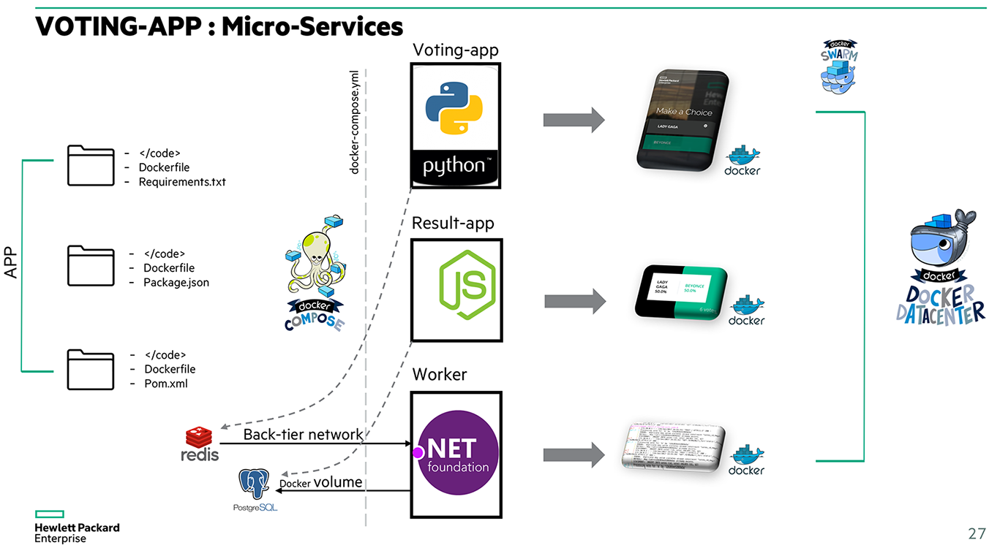

Getting started
---------------

Pivotal version (based on "Docker-voting-app") to demonstrate a micro-services App with Docker.

Run in this directory:

    $ docker-compose up

The app will be running at [http://localhost:5000](http://localhost:5000), and the results will be at [http://localhost:5001](http://localhost:5001).

Architecture
-----

* A Python webapp which lets you vote between two options
* A Redis queue which collects new votes
* A .NET worker which consumes votes and stores them in…
* A Postgres database backed by a Docker volume
* A Node.js webapp which shows the results of the voting in real time

Customize it!
-----

* Edit vote/app.py
* Edit result/views/index.html
colors:
/* 
couleur 1 HP: #00b188 -> #00b5a3
Couleur 2 HP: #323433 -> #0066ab
Couleur 3 HP:

hover: #614866 -> #f27062

focus: #fd8d71 -> #009fdf

*/

